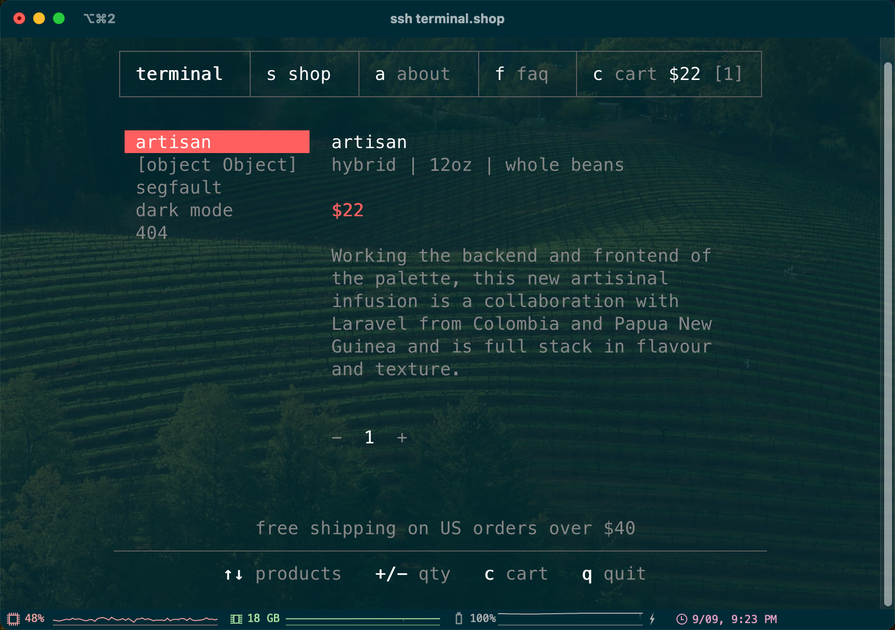

+++
category = "Developing"
tags = ["Linux"]
+++
# 通过 SSH 访问在线命令行工具
起因是前段时间偶然刷到了一个在命令行中购买咖啡的服务 [terminal.shop](https://www.terminal.shop/)，该服务只需通过 `ssh terminal.shop` 即可进入一个 TUI 程序，无需任何注册，也无需提前设置公钥或密码等。这个方法非常巧妙，避免了分发程序的过程，同时由于 SSH 公钥天然可以用于鉴权，用户也无需任何前置程序（在不需要与其他身份信息关联的前提下）即可直接访问。



正好在工作中我也正准备实现一个命令行工具，前段时间还在调研如何通过 homebrew 等渠道进行分发，这个方式既能解决分发的难题（简单到只需要 `echo 'alias cli="ssh server --"' >> ~/.bashrc`），又能确保用户总是使用最新的版本，可以有效减少用户问题。考虑到还存在在镜像中打包该程序的需求，免更新的优点就更加重要。因此我立即决定要模仿这一服务实现我自己的命令行程序。

当然，我也可以选择直接分发二进制程序并在程序中集成自我更新的逻辑，但是我不喜欢这种不使用包管理器的“非受控”的形式；如果想要通过包管理器为大部分用户分发，那么我至少需要自建 homebrew 和 apt 源，对用户来说使用成本也相当高；自建 npm / pip 源分发可以略微改善这一问题，但是我非常希望用 rust 开发本项目，这些方案的复杂度都远超使用 SSH 部署服务。

## 实现方式
首先尝试推测 terminal.shop 的实现原理，该服务允许任意的用户名和 SSH 公钥登录，这里用户名实际上没有任何意义，服务端只需依据公钥认证用户身份，然后修改入口命令，强制用户进入 TUI 程序即可。

随后通过与 ChatGPT 反复拉扯和一段时间的测试，我大致确定了实现该效果的方法：

### 允许任意用户登录
这部分还没成功，似乎需要使用 PAM，但是目前的测试都没有生效。

### 允许任意公钥登录
通常来说添加公钥认证的方式是在 `$HOME/.ssh/authorized_keys` 文件中写入公钥，但实际这一行为并非固定的，查阅 sshd_config 的文档我们看到：
> #### AuthorizedKeysCommand
> Specifies a program to be used to look up the user's public keys.  The program must be owned by root, not writable by group or others and specified by an absolute path.  Arguments to AuthorizedKeysCommand accept the tokens described in the TOKENS section.  If no arguments are specified then the username of the target user is used.
> 
> The program should produce on standard output zero or more lines of authorized_keys output (see AUTHORIZED_KEYS in sshd(8)).  AuthorizedKeysCommand is tried after the usual AuthorizedKeysFile files and will not be executed if a matching key is found there.  By default, no AuthorizedKeysCommand is run.
> 
> #### AuthorizedKeysFile
>
> Specifies the file that contains the public keys used for user authentication.  The format is described in the AUTHORIZED_KEYS FILE FORMAT section of sshd(8).  Arguments to AuthorizedKeysFile accept the tokens described in the TOKENS section.  After expansion, AuthorizedKeysFile is taken to be an absolute path or one relative to the user's home directory.  Multiple files may be listed, separated by whitespace.  Alternately this option may be set to none to skip checking for user keys in files.  The default is ".ssh/authorized_keys .ssh/authorized_keys2".

简单来说，`sshd` 的默认行为是在 `.ssh/authorized_keys` 和 `.ssh/authorized_keys2` 两个文件中查找公钥，但也可以通过 `AuthorizedKeysCommand` 指定一个命令来查找公钥，而该命令可以使用下列的 `TOKENS`：
> #### TOKENS
> Arguments to some keywords can make use of tokens, which are expanded at runtime:
> - %%    A literal ‘%’.
> - %C    Identifies the connection endpoints, containing four space-separated values: client address, client port number, server address, and server port number.
> - %D    The routing domain in which the incoming connection was received.
> - %F    The fingerprint of the CA key.
> - %f    The fingerprint of the key or certificate.
> - %h    The home directory of the user.
> - %i    The key ID in the certificate.
> - %K    The base64-encoded CA key.
> - %k    The base64-encoded key or certificate for authentication.
> - %s    The serial number of the certificate.
> - %T    The type of the CA key.
> - %t    The key or certificate type.
> - %U    The numeric user ID of the target user.
> - %u    The username.
> 
> AuthorizedKeysCommand accepts the tokens %%, %C, %D, %f, %h, %k, %t, %U, and %u.

因此一个最简单的允许任意用户登录的配置方式就是：
```bash
# /etc/ssh/sshd_config

AuthorizedKeysCommand /bin/bash -c "echo '%t %k'"
# 注意必须配置 AuthorizedKeysCommandUser 才会执行 AuthorizedKeysCommand
AuthorizedKeysCommandUser root
```

该配置直接返回了用户所提供的公钥，从而允许任何的公钥完成登录。

### 修改 SSH 入口命令
这一步相对来说比较简单，`sshd_config` 提供了 `ForceCommand` 允许指定登录后启动的进程，直接修改为编译好的命令行程序绝对路径即可，同时由于 `sshd` 默认会将用户提供的命令保存在环境变量 `SSH_ORIGINAL_COMMAND` 中，只需要使用一个简单的脚本封装即可将命令行参数传给我们的程序。

但这里发现的一个 SSH 自身的问题是，传递 `SSH_ORIGINAL_COMMAND` 会进行一次转义，例如在正常情况下如果我们执行：
```bash
ssh hostname ls "/path/to/filename with whitespace"
```

这里文件名中带有空格，但是使用引号包裹，理论上并不会出错，但是实际传递的 `SSH_ORIGINAL_COMMAND` 会是 `ls /path/to/filename with whitespace`，与我们实际想要的不同，这个问题应该没有合理的解决方法（毕竟上面的例子也无法解决），建议的做法是用户使用的时候自行使用两层引号（`'"xxx"'`)。

### 传递用户公钥
尽管上述方式实现了任意公钥通过 `sshd` 鉴权，但是这并没有实现我们系统内的鉴权，即需要根据公钥识别用户身份，这里我的思路是将用户公钥传递给我们的命令行程序，并在程序入口使用该公钥向后端请求登录（由于我们的系统是有身份的，这里需要用户提前配置自己的公钥）。这就需要将公钥直接传递给命令行程序，但我们注意到，在 `ForceCommand` 时并不允许使用 `TOKENS`，实际上，只有在 `AuthorizedKeysCommand` 和 `AuthorizedPrincipalsCommand` 两个字段中允许使用最重要的 `%k`，因此我们还得在 `AuthorizedKeysCommand` 上做文章。

这里再次阅读文档发现，所谓的 `authorized_keys output (see AUTHORIZED_KEYS in sshd(8))` 实际并不是只能存放一个公钥，而是有很多字段可以设置，其中包括：

> #### command="command"
> Specifies that the command is executed whenever this key is used for authentication.  The command supplied by the user (if any) is ignored.  The command is run on a pty if the client requests a pty; otherwise it is run without a tty.  If an 8-bit clean channel is required, one must not request a pty or should specify no-pty.  A quote may be included in the command by quoting it with a backslash.
>
> This option might be useful to restrict certain public keys to perform just a specific operation.  An example might be a key that permits remote backups but nothing else.  Note that the client may specify TCP and/or X11 forwarding unless they are explicitly prohibited, e.g. using the restrict key option.
>
> The command originally supplied by the client is available in the SSH_ORIGINAL_COMMAND environment variable.  Note that this option applies to shell, command or subsystem execution.  Also note that this command may be superseded by a sshd_config(5) ForceCommand directive.
>
> If a command is specified and a forced-command is embedded in a certificate used for authentication, then the certificate will be accepted only if the two commands are identical.
> #### environment="NAME=value"
> Specifies that the string is to be added to the environment when logging in using this key.  Environment variables set this way override other default environment values.  Multiple options of this type are permitted.  Environment processing is disabled by default and is controlled via the PermitUserEnvironment option.

因此这里可以一次性设置好两个需要的值：
```bash
# /etc/ssh/sshd_config

AuthorizedKeysCommand /bin/bash -c "echo 'command=\"/run.sh\",environment=\"SSH_PUBLIC_KEY_DIGEST=%f\" %t %k'"
AuthorizedKeysCommandUser root
# 为了允许通过 AuthorizedKeys 传递环境变量，还需要设置
PermitUserEnvironment yes
```
